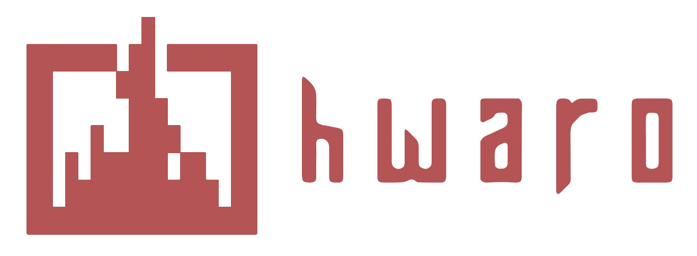

<div align="center">
  
  <p>A lightweight and fast static site generator written in Crystal.</p>
</div>

<p align="center">
<a href="https://github.com/hahwul/hwaro/blob/main/CONTRIBUTING.md">
</a>
<a href="https://github.com/hahwul/hwaro/releases">
</a>
<a href="https://crystal-lang.org">
</a>
</p>

<p align="center">
  <a href="https://hwaro.hahwul.com/start/">Documentation</a> •
  <a href="https://hwaro.hahwul.com/start/installation/">Installation</a> •
  <a href="https://hwaro.hahwul.com/deploy/github-pages/">Github Action</a> •
  <a href="#contributing">Contributing</a> •
  <a href="CHANGELOG.md">Changelog</a>
</p>

---

Hwaro processes Markdown content with TOML front matter and Jinja2-compatible templates (Crinja) to build high-performance static sites. It features parallel builds, incremental caching, and a built-in dev server with live reload.

<details>
<summary><strong>Features</strong></summary>

### Content & Templating
- Markdown with TOML/YAML front matter
- Jinja2 templates (inheritance, includes, macros)
- Markdown extensions: task lists, footnotes, definition lists, math (KaTeX/MathJax), Mermaid diagrams, emoji, etc
- Syntax highlighting via Highlight.js
- Non-markdown content file publishing

### Build & Performance
- Parallel processing and incremental build caching
- Streaming build mode with memory limits
- Pre/post build hooks
- CSS/JS bundling, minification, and content-hash fingerprinting

### SEO & Discovery
- Auto-generated sitemap, robots.txt, RSS/Atom feeds
- OpenGraph meta tags and auto-generated OG images (PNG)
- Twitter Cards and JSON-LD structured data
- `llms.txt` and `AGENTS.md` generation
- Client-side search index (Fuse.js, ElasticLunr) with CJK tokenization

### Site Features
- Pagination, taxonomies (tags, categories, custom)
- Content series and related posts
- Multilingual (i18n) with per-language feeds and search
- Image processing (resize, responsive images) and Auto generated OG Image
- PWA support (manifest, service worker)
- AMP page generation

### Development & Deployment
- Dev server with live reload and error overlay
- Scaffolding with built-in themes (`blog`, `docs`, `blog-dark`, `docs-dark`)
- Deploy to multiple targets with dry-run support
- Platform config generation (Netlify, Vercel, Cloudflare Pages)
- GitHub Actions CI/CD generation
- Import from WordPress, Jekyll, Hugo
- Link checker and config doctor

</details>

## Installation

### Homebrew

```bash
brew tap hahwul/hwaro
brew install hwaro
```

### From source

```bash
# Clone the repository
git clone https://github.com/hahwul/hwaro.git
cd hwaro

# Install dependencies
shards install

# Build
shards build --release --no-debug --production
```

## Contributing

Hwaro is an open-source project made with ❤️. If you would like to contribute, please check [CONTRIBUTING.md](CONTRIBUTING.md) and submit a Pull Request.


## Why "Hwaro"?

Hwaro (화로) is the Korean word for **Furnace** — the same name used in Minecraft's Korean localization. In the game, the Furnace is an essential tool that transforms raw materials into useful items. Hwaro aims to serve the same role for static sites: feed in your content, and it crafts a complete website.
