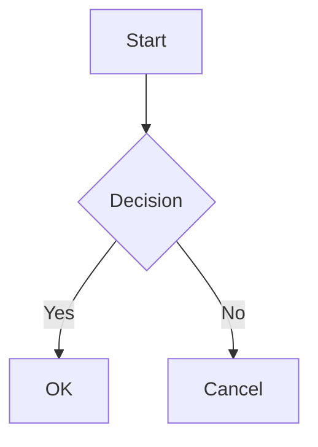

+++
title = "마크다운 확장"
description = "표준 CommonMark를 넘어서는 선택적 마크다운 확장"
weight = 8
toc = true
+++

Hwaro는 표준 CommonMark를 넘어서는 선택적 마크다운 확장을 지원합니다. 각 확장은 `config.toml`에서 켜고 끌 수 있습니다(기본값은 아래 표 참고).

## 설정

```toml
[markdown]
task_lists = true
definition_lists = true
footnotes = true
math = true
math_engine = "katex"
mermaid = true
```

| 키 | 타입 | 기본값 | 설명 |
|-----|------|---------|-------------|
| task_lists | bool | true | 체크박스 목록(`- [ ]` / `- [x]`) |
| definition_lists | bool | true | 정의 목록(`Term\n: Definition`) |
| footnotes | bool | true | 각주(`[^1]`) |
| math | bool | false | 수식(`$...$`, `$$...$$`) |
| math_engine | string | "katex" | 수식 렌더링 엔진(`"katex"` 또는 `"mathjax"`) |
| mermaid | bool | false | Mermaid 다이어그램 블록 |
| admonitions | bool | true | GitHub 스타일 `> [!NOTE]` 인용문을 admonition 블록으로 변환 |
| heading_ids | bool | true | 커스텀 헤딩 ID(`## Heading {#custom-id}`) |
| ins | bool | false | 삽입 텍스트(`++text++` → `<ins>text</ins>`) |
| mark | bool | false | 강조 표시 텍스트(`==text==` → `<mark>text</mark>`) |
| sub | bool | false | 아래 첨자(`~text~` → `<sub>text</sub>`) |
| sup | bool | false | 위 첨자(`^text^` → `<sup>text</sup>`) |
| attributes | bool | false | 헤딩과 인라인 이미지에 붙는 일반화된 `{#id .class key=val}` 블록 |
| safe | bool | false | 출력에서 원시 HTML 제거(주석으로 대체) |
| lazy_loading | bool | false | `` 태그에 `loading="lazy"` 추가 |
| emoji | bool | false | 이모지 숏코드(예: `:smile:`)를 이모지 문자로 변환 |
| smart_punctuation | bool | false | 타이포그래피 따옴표/대시/줄임표 |
| containers | bool | false | `:::note Title` … `:::` 커스텀 컨테이너 |
| task_list_classes | bool | false | 작업 목록 마크업에 GFM 클래스 부여 |
| insert_anchor_links | string | "none" | 사이트 전역 헤딩 앵커 링크(`"none"`/`"left"`/`"right"`) |
| external_links_target_blank | bool | false | 절대 http(s) 링크에 `target="_blank" rel="noopener"` |
| external_links_no_follow | bool | false | 절대 http(s) 링크에 `rel="nofollow"` |
| external_links_no_referrer | bool | false | 절대 http(s) 링크에 `rel="noreferrer"` |

## 작업 목록

목록 안에 체크박스를 렌더링합니다.

### 문법

```markdown
- [x] Completed task
- [ ] Incomplete task
- [X] Also completed (case-insensitive)
```

### 출력

```html
<ul>
  <li><input type="checkbox" checked disabled> Completed task</li>
  <li><input type="checkbox" disabled> Incomplete task</li>
  <li><input type="checkbox" checked disabled> Also completed</li>
</ul>
```

## 정의 목록

`<dl>`, `<dt>`, `<dd>` 요소로 용어와 정의를 렌더링합니다.

### 문법

```markdown
Crystal
: A compiled language with Ruby-like syntax

Go
: A statically typed, compiled language by Google
```

### 출력

```html
<dl>
  <dt>Crystal</dt>
  <dd>A compiled language with Ruby-like syntax</dd>
  <dt>Go</dt>
  <dd>A statically typed, compiled language by Google</dd>
</dl>
```

## 각주

각주 참조와 정의를 추가합니다.

### 문법

```markdown
This is a statement[^1] with multiple references[^note].

[^1]: First footnote content.
[^note]: Named footnote content.
```

### 출력

참조는 위 첨자 링크가 됩니다.

```html
<p>This is a statement<sup class="footnote-ref"><a href="#fn-1" id="fnref-1">[1]</a></sup>
with multiple references<sup class="footnote-ref"><a href="#fn-note" id="fnref-note">[2]</a></sup>.</p>
```

문서 끝에 각주 섹션이 덧붙습니다.

```html
<section class="footnotes">
  <hr>
  <ol>
    <li id="fn-1"><p>First footnote content. <a href="#fnref-1" class="footnote-backref">↩</a></p></li>
    <li id="fn-note"><p>Named footnote content. <a href="#fnref-note" class="footnote-backref">↩</a></p></li>
  </ol>
</section>
```

## 수식

수학 표현식을 렌더링합니다. 클라이언트 사이드 수식 라이브러리(KaTeX 또는 MathJax)가 필요합니다.

### 문법

인라인 수식은 `$` 하나로 감쌉니다.

```markdown
The equation $E = mc^2$ is well known.
```

디스플레이 수식은 `$$` 두 개로 감쌉니다.

```markdown
$$
\int_0^\infty e^{-x^2} dx = \frac{\sqrt{\pi}}{2}
$$
```

### 출력

```html
<p>The equation <span class="math math-inline">\(E = mc^2\)</span> is well known.</p>

<div class="math math-display">\[\int_0^\infty e^{-x^2} dx = \frac{\sqrt{\pi}}{2}\]</div>
```

### 클라이언트 사이드 설정

#### KaTeX

```html
<link rel="stylesheet" href="https://cdn.jsdelivr.net/npm/katex/dist/katex.min.css">
<script src="https://cdn.jsdelivr.net/npm/katex/dist/katex.min.js"></script>
<script src="https://cdn.jsdelivr.net/npm/katex/dist/contrib/auto-render.min.js"></script>
<script>
  document.addEventListener("DOMContentLoaded", function() {
    renderMathInElement(document.body);
  });
</script>
```

#### MathJax

```html
<script>
  MathJax = { tex: { inlineMath: [['\\(', '\\)']], displayMath: [['\\[', '\\]']] } };
</script>
<script src="https://cdn.jsdelivr.net/npm/mathjax@3/es5/tex-mml-chtml.js"></script>
```

## Mermaid 다이어그램

Mermaid 다이어그램 블록을 `<div class="mermaid">` 요소로 렌더링합니다.

이는 [렌더 훅](/ko/templates/render-hooks/)의 "항상 적용" 규칙에 대한 유일한 예외입니다. `mermaid = true`이면 `` ```mermaid `` 펜스는 `render-codeblock.html` 훅이 설정되어 있어도 항상 이 파이프라인을 거칩니다. 코드블록 훅이 다른 언어처럼 mermaid 펜스도 처리하게 하려면 `mermaid = false`로 설정합니다.

### 문법

````markdown

````

### 출력

```html
<div class="mermaid">
graph TD
    A[Start] --> B{Decision}
    B -->|Yes| C[OK]
    B -->|No| D[Cancel]
</div>
```

### 클라이언트 사이드 설정

```html
<script src="https://cdn.jsdelivr.net/npm/mermaid/dist/mermaid.min.js"></script>
<script>mermaid.initialize({ startOnLoad: true });</script>
```

## 인라인 마크업(ins, mark, sub, sup)

각각 별도 플래그 뒤에 있는 네 가지 옵트인 인라인 스타일입니다. 기본값이 모두 꺼짐이므로, 하나를 켜도 나머지에는 영향이 없습니다.

### 문법

```markdown
++Inserted text++ and ==highlighted text==.
Formula: x~2~ + y^2^ = z~n~
```

```toml
[markdown]
ins = true
mark = true
sub = true
sup = true
```

### 출력

```html
<p><ins>Inserted text</ins> and <mark>highlighted text</mark>.
Formula: x<sub>2</sub> + y<sup>2</sup> = z<sub>n</sub></p>
```

### 제한 사항

- **백슬래시 이스케이프가 없습니다.** 네 구분자 모두 CommonMark 스타일 `\` 이스케이프로 변환을 억제할 수 없고, 시도했을 때의 결과도 일관적이지 않습니다 — 백슬래시가 리터럴 구분자나 스타일된 결과 대신 깨진 이스케이프 태그 출력을 남길 수 있습니다. 문법을 텍스트 그대로 보여야 할 때는 코드 스팬(`` `++literal++` ``)을 사용합니다.
- **구분자 관련 주의점:** `++`/`==`/`~`/`^`는 모두 내용 양쪽에 비공백 문자가 있어야 동작하므로, 산술식처럼 생긴 텍스트(`a ~ b`, `x ^ y`, 공백이 있는 `a == b`)는 건드리지 않습니다. 단일 `~`와 `^`는 취소선의 `~~`나 일반 `**`/`__` 강조와 의도적으로 분리되어 있어 같은 줄의 `~~del~~`과 `~sub~`가 모두 동작합니다. 다만 리터럴 `~`/`^`/`==`/`++`가 많은 페이지(셸 프롬프트, C/C++ 스니펫, XOR이 많은 코드)는 어차피 코드 스팬이나 펜스 코드 블록에 담아 두는 편이 좋습니다 — sub/sup/ins/mark는 그 바깥에서만 적용되기 때문입니다.
- `footnotes`가 함께 켜져 있어도 `sup`이 각주 참조(`[^1]`)를 망가뜨리지 않습니다.

## 속성(`{#id .class key=val}`)

헤딩이나 인라인 이미지에 붙는 pandoc 스타일 속성 블록입니다. [커스텀 헤딩 ID](/ko/writing/pages/) 축약 문법을 일반화한 것으로, 클래스와 임의 속성까지 설정할 수 있고 이미지에도 적용됩니다.

### 문법

```markdown
## Section Title {#section-title .highlight data-index=3}

{.responsive width=800}
```

```toml
[markdown]
attributes = true
```

### 출력

```html
<h2 id="section-title" class="highlight" data-index="3">Section Title</h2>


```

토큰은 공백으로 구분합니다(쉼표는 구분자가 아님). `#id`는 id를 설정하고, `.class`는 클래스를 추가하며(반복 가능), `key=value` / `key="quoted value"`는 그 밖의 속성을 설정합니다. `id=value`와 `class=value`는 `#value` / `.value`의 별칭으로 허용됩니다. 유효하지 않은 토큰이 하나라도 있으면 블록 전체가 무효가 되어 원본 `{...}`이 그대로 남습니다.

### 제한 사항

- **v1 범위는 헤딩과 인라인 이미지뿐입니다** — 다른 요소(문단, 링크, 코드 스팬, 목록 항목) 뒤의 속성 블록은 지원되지 않고 리터럴 텍스트로 남습니다.
- 다른 토큰 없이 `## Heading {#id}`만 있는 경우는 `attributes`가 켜져 있어도 여전히 더 좁은 `heading_ids` 메커니즘이 처리합니다. 따라서 `attributes`를 켜도 기존 `{#id}` 전용 헤딩은 달라지지 않습니다.
- **safe 모드는 블록을 버립니다.** `markdown.safe = true`이면 `{...}` 속성 블록이 출력에서 제거되며(`heading_ids`와 동일), 어떤 속성도 적용되지 않습니다.

## 스마트 문장부호

`smart_punctuation = true`이면 곧은 따옴표, 이중/삼중 대시, 점 세 개가 타이포그래피 형태로 바뀝니다.

| 입력 | 출력 |
|-------|--------|
| `"quoted"` / `'quoted'` | “quoted” / ‘quoted’ |
| `--` | – (en dash) |
| `---` | — (em dash) |
| `...` | … (ellipsis) |

코드 스팬, 코드 블록, 원시 HTML, 수식 본문은 절대 다시 쓰지 않습니다. 표 셀, 정의 본문, 각주 본문은 미리 렌더링된 HTML이라 그 내부에는 스마트 문장부호가 적용되지 않습니다. `markdownify` 템플릿 필터는 사이트 설정을 따릅니다.

## 커스텀 컨테이너

`containers = true`이면 `:::` 펜스 블록이 admonition과 같은 마크업(과 CSS)으로 렌더링됩니다.

```markdown
:::note Optional Title
Any **markdown** body — code fences and task lists included.
:::
```

제목의 기본값은 타입을 대문자로 시작한 형태입니다. 더 긴 구분자는 중첩되고(`::::outer` … `:::inner` … `:::` … `::::`), 단독 `:::`는 가장 안쪽의 열린 컨테이너를 닫으며, 닫히지 않은 컨테이너는 페이지 끝에서 자동으로 닫힙니다. 코드 펜스 안의 `:::` 줄은 리터럴로 남습니다. `safe = true`와는 함께 쓸 수 없습니다(원시 래퍼가 제거되기 때문).

## 작업 목록 클래스

`task_list_classes = true`이면 작업 목록 마크업에 GFM의 클래스가 붙어 GitHub 대상 CSS가 그대로 적용됩니다. `<li class="task-list-item">`, 체크박스의 `class="task-list-item-checkbox"`, 작업 항목을 직접 포함하는 모든 목록의 `class="contains-task-list"`가 붙습니다. 기존 사이트의 출력을 바이트 단위로 동일하게 유지하기 위해 기본값은 꺼짐입니다.

## 헤딩 앵커 링크

`insert_anchor_links = "left"`(또는 `"right"`)는 사이트 전체의 모든 헤딩에 `🔗` 앵커 링크를 헤딩 텍스트 앞 또는 뒤에 추가합니다. 페이지 프론트 매터의 `insert_anchor_links = true/false`가 사이트 설정을 페이지 단위로 덮어씁니다. 마크업을 완전히 바꾸려면 [render-heading 훅](/ko/templates/render-hooks/)을 사용합니다.

## 외부 링크 정책

세 가지 플래그가 렌더링된 마크다운(표 셀과 각주 포함)의 절대 `http(s)://` 링크에 사이트 전역 정책을 적용합니다.

```toml
[markdown]
external_links_target_blank = true # target="_blank" + rel="noopener"
external_links_no_follow = true    # rel="nofollow"
external_links_no_referrer = true  # rel="noreferrer"
```

이미 `target=`을 가진 링크는 그대로 유지되고, `rel` 토큰은 기존 `rel` 속성에 중복 없이 병합됩니다 — 즉 render-link 훅이 명시한 선택이 우선합니다. 이 정책은 자신의 도메인을 가리키는 링크를 포함해 모든 절대 http(s) 링크에 적용됩니다.

## 여러 줄 각주와 정의

각주 정의는 4칸 공백(또는 탭)으로 들여쓴 이어지는 줄을 수집하며, 빈 줄로 구분된 문단도 포함합니다.

```markdown
[^1]: First paragraph of the note,
    soft-wrapped onto a second line.

    Second paragraph of the same note.
```

정의 목록 본문도 같은 방식으로 이어집니다(들여쓴 줄이 같은 `<dd>`에 합쳐짐). 들여쓰지 않은(lazy) 이어쓰기, 각주 본문 안의 블록 요소, 여러 문단으로 된 `<dd>`는 지원되지 않습니다.

## 함께 보기

- [설정](/ko/start/config/) — 마크다운 설정 옵션
- [구문 강조](/ko/features/syntax-highlighting/) — 코드 블록 강조
- [렌더 훅](/ko/templates/render-hooks/) — 링크·이미지·헤딩·코드 블록 렌더링 방식 재정의
