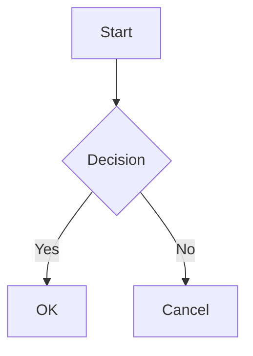

+++
title = "Markdown Extensions"
weight = 7
toc = true
+++

Hwaro supports optional markdown extensions beyond standard CommonMark. Each extension is disabled by default and can be enabled in `config.toml`.

## Configuration

```toml
[markdown]
task_lists = true
definition_lists = true
footnotes = true
math = true
math_engine = "katex"
mermaid = true
```

| Key | Type | Default | Description |
|-----|------|---------|-------------|
| task_lists | bool | false | Checkbox lists (`- [ ]` / `- [x]`) |
| definition_lists | bool | false | Definition lists (`Term\n: Definition`) |
| footnotes | bool | false | Footnotes (`[^1]`) |
| math | bool | false | Math expressions (`$...$` and `$$...$$`) |
| math_engine | string | "katex" | Math rendering engine (`"katex"` or `"mathjax"`) |
| mermaid | bool | false | Mermaid diagram blocks |

## Task Lists

Render checkboxes in lists.

### Syntax

```markdown
- [x] Completed task
- [ ] Incomplete task
- [X] Also completed (case-insensitive)
```

### Output

```html
<ul>
  <li><input type="checkbox" checked disabled> Completed task</li>
  <li><input type="checkbox" disabled> Incomplete task</li>
  <li><input type="checkbox" checked disabled> Also completed</li>
</ul>
```

## Definition Lists

Render terms with their definitions using `<dl>`, `<dt>`, and `<dd>` elements.

### Syntax

```markdown
Crystal
: A compiled language with Ruby-like syntax

Go
: A statically typed, compiled language by Google
```

### Output

```html
<dl>
  <dt>Crystal</dt>
  <dd>A compiled language with Ruby-like syntax</dd>
  <dt>Go</dt>
  <dd>A statically typed, compiled language by Google</dd>
</dl>
```

## Footnotes

Add footnote references and definitions.

### Syntax

```markdown
This is a statement[^1] with multiple references[^note].

[^1]: First footnote content.
[^note]: Named footnote content.
```

### Output

References become superscript links:

```html
<p>This is a statement<sup class="footnote-ref"><a href="#fn-1" id="fnref-1">[1]</a></sup>
with multiple references<sup class="footnote-ref"><a href="#fn-note" id="fnref-note">[2]</a></sup>.</p>
```

A footnotes section is appended at the end:

```html
<section class="footnotes">
  <hr>
  <ol>
    <li id="fn-1"><p>First footnote content. <a href="#fnref-1" class="footnote-backref">↩</a></p></li>
    <li id="fn-note"><p>Named footnote content. <a href="#fnref-note" class="footnote-backref">↩</a></p></li>
  </ol>
</section>
```

## Math

Render mathematical expressions. Requires a client-side math library (KaTeX or MathJax).

### Syntax

Inline math with single `$`:

```markdown
The equation $E = mc^2$ is well known.
```

Display math with double `$$`:

```markdown
$$
\int_0^\infty e^{-x^2} dx = \frac{\sqrt{\pi}}{2}
$$
```

### Output

```html
<p>The equation <span class="math math-inline">\(E = mc^2\)</span> is well known.</p>

<div class="math math-display">\[\int_0^\infty e^{-x^2} dx = \frac{\sqrt{\pi}}{2}\]</div>
```

### Client-Side Setup

#### KaTeX

```html
<link rel="stylesheet" href="https://cdn.jsdelivr.net/npm/katex/dist/katex.min.css">
<script src="https://cdn.jsdelivr.net/npm/katex/dist/katex.min.js"></script>
<script src="https://cdn.jsdelivr.net/npm/katex/dist/contrib/auto-render.min.js"></script>
<script>
  document.addEventListener("DOMContentLoaded", function() {
    renderMathInElement(document.body);
  });
</script>
```

#### MathJax

```html
<script>
  MathJax = { tex: { inlineMath: [['\\(', '\\)']], displayMath: [['\\[', '\\]']] } };
</script>
<script src="https://cdn.jsdelivr.net/npm/mathjax@3/es5/tex-mml-chtml.js"></script>
```

## Mermaid Diagrams

Render Mermaid diagram blocks as `<div class="mermaid">` elements.

### Syntax

````markdown

````

### Output

```html
<div class="mermaid">
graph TD
    A[Start] --> B{Decision}
    B -->|Yes| C[OK]
    B -->|No| D[Cancel]
</div>
```

### Client-Side Setup

```html
<script src="https://cdn.jsdelivr.net/npm/mermaid/dist/mermaid.min.js"></script>
<script>mermaid.initialize({ startOnLoad: true });</script>
```

## See Also

- [Configuration](/start/config/) — Markdown configuration options
- [Syntax Highlighting](/features/syntax-highlighting/) — Code block highlighting
