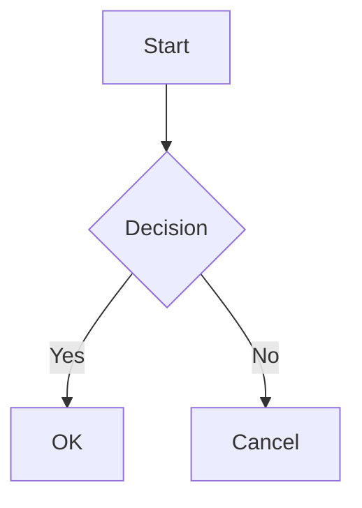

+++
title = "Markdown Extensions"
description = "Optional markdown extensions beyond standard CommonMark"
weight = 8
toc = true
+++

Hwaro supports optional markdown extensions beyond standard CommonMark. Each extension can be toggled in `config.toml` (see the table below for defaults).

## Configuration

```toml
[markdown]
task_lists = true
definition_lists = true
footnotes = true
math = true
math_engine = "katex"
mermaid = true
```

| Key | Type | Default | Description |
|-----|------|---------|-------------|
| task_lists | bool | true | Checkbox lists (`- [ ]` / `- [x]`) |
| definition_lists | bool | true | Definition lists (`Term\n: Definition`) |
| footnotes | bool | true | Footnotes (`[^1]`) |
| math | bool | false | Math expressions (`$...$` and `$$...$$`) |
| math_engine | string | "katex" | Math rendering engine (`"katex"` or `"mathjax"`) |
| mermaid | bool | false | Mermaid diagram blocks |
| admonitions | bool | true | GitHub-style `> [!NOTE]` blockquotes become admonition blocks |
| heading_ids | bool | true | Custom heading IDs (`## Heading {#custom-id}`) |
| ins | bool | false | Inserted text (`++text++` → `<ins>text</ins>`) |
| mark | bool | false | Highlighted text (`==text==` → `<mark>text</mark>`) |
| sub | bool | false | Subscript (`~text~` → `<sub>text</sub>`) |
| sup | bool | false | Superscript (`^text^` → `<sup>text</sup>`) |
| attributes | bool | false | Generalized `{#id .class key=val}` blocks on headings and inline images |
| safe | bool | false | Strip raw HTML from output (replaced with comments) |
| lazy_loading | bool | false | Add `loading="lazy"` to `` tags |
| emoji | bool | false | Convert emoji shortcodes (e.g. `:smile:`) to emoji characters |
| smart_punctuation | bool | false | Typographic quotes/dashes/ellipses |
| containers | bool | false | `:::note Title` … `:::` custom containers |
| task_list_classes | bool | false | GFM classes on task-list markup |
| insert_anchor_links | string | "none" | Site-wide heading anchor links (`"none"`/`"left"`/`"right"`) |
| external_links_target_blank | bool | false | `target="_blank" rel="noopener"` on absolute http(s) links |
| external_links_no_follow | bool | false | `rel="nofollow"` on absolute http(s) links |
| external_links_no_referrer | bool | false | `rel="noreferrer"` on absolute http(s) links |

## Task Lists

Render checkboxes in lists.

### Syntax

```markdown
- [x] Completed task
- [ ] Incomplete task
- [X] Also completed (case-insensitive)
```

### Output

```html
<ul>
  <li><input type="checkbox" checked disabled> Completed task</li>
  <li><input type="checkbox" disabled> Incomplete task</li>
  <li><input type="checkbox" checked disabled> Also completed</li>
</ul>
```

## Definition Lists

Render terms with their definitions using `<dl>`, `<dt>`, and `<dd>` elements.

### Syntax

```markdown
Crystal
: A compiled language with Ruby-like syntax

Go
: A statically typed, compiled language by Google
```

### Output

```html
<dl>
  <dt>Crystal</dt>
  <dd>A compiled language with Ruby-like syntax</dd>
  <dt>Go</dt>
  <dd>A statically typed, compiled language by Google</dd>
</dl>
```

## Footnotes

Add footnote references and definitions.

### Syntax

```markdown
This is a statement[^1] with multiple references[^note].

[^1]: First footnote content.
[^note]: Named footnote content.
```

### Output

References become superscript links:

```html
<p>This is a statement<sup class="footnote-ref"><a href="#fn-1" id="fnref-1">[1]</a></sup>
with multiple references<sup class="footnote-ref"><a href="#fn-note" id="fnref-note">[2]</a></sup>.</p>
```

A footnotes section is appended at the end:

```html
<section class="footnotes">
  <hr>
  <ol>
    <li id="fn-1"><p>First footnote content. <a href="#fnref-1" class="footnote-backref">↩</a></p></li>
    <li id="fn-note"><p>Named footnote content. <a href="#fnref-note" class="footnote-backref">↩</a></p></li>
  </ol>
</section>
```

## Math

Render mathematical expressions. Requires a client-side math library (KaTeX or MathJax).

### Syntax

Inline math with single `$`:

```markdown
The equation $E = mc^2$ is well known.
```

Display math with double `$$`:

```markdown
$$
\int_0^\infty e^{-x^2} dx = \frac{\sqrt{\pi}}{2}
$$
```

### Output

```html
<p>The equation <span class="math math-inline">\(E = mc^2\)</span> is well known.</p>

<div class="math math-display">\[\int_0^\infty e^{-x^2} dx = \frac{\sqrt{\pi}}{2}\]</div>
```

### Client-Side Setup

#### KaTeX

```html
<link rel="stylesheet" href="https://cdn.jsdelivr.net/npm/katex/dist/katex.min.css">
<script src="https://cdn.jsdelivr.net/npm/katex/dist/katex.min.js"></script>
<script src="https://cdn.jsdelivr.net/npm/katex/dist/contrib/auto-render.min.js"></script>
<script>
  document.addEventListener("DOMContentLoaded", function() {
    renderMathInElement(document.body);
  });
</script>
```

#### MathJax

```html
<script>
  MathJax = { tex: { inlineMath: [['\\(', '\\)']], displayMath: [['\\[', '\\]']] } };
</script>
<script src="https://cdn.jsdelivr.net/npm/mathjax@3/es5/tex-mml-chtml.js"></script>
```

## Mermaid Diagrams

Render Mermaid diagram blocks as `<div class="mermaid">` elements.

This is the one exception to [render hooks](/templates/render-hooks/)' "always applies" rule: with `mermaid = true`, a `` ```mermaid `` fence always goes through this pipeline instead of a `render-codeblock.html` hook, even if one is configured. Set `mermaid = false` to have a codeblock hook own mermaid fences like any other language.

### Syntax

````markdown

````

### Output

```html
<div class="mermaid">
graph TD
    A[Start] --> B{Decision}
    B -->|Yes| C[OK]
    B -->|No| D[Cancel]
</div>
```

### Client-Side Setup

```html
<script src="https://cdn.jsdelivr.net/npm/mermaid/dist/mermaid.min.js"></script>
<script>mermaid.initialize({ startOnLoad: true });</script>
```

## Inline Markup (ins, mark, sub, sup)

Four opt-in inline styles, each behind its own flag — off by default, so
turning one on never affects the others.

### Syntax

```markdown
++Inserted text++ and ==highlighted text==.
Formula: x~2~ + y^2^ = z~n~
```

```toml
[markdown]
ins = true
mark = true
sub = true
sup = true
```

### Output

```html
<p><ins>Inserted text</ins> and <mark>highlighted text</mark>.
Formula: x<sub>2</sub> + y<sup>2</sup> = z<sub>n</sub></p>
```

### Limitations

- **No backslash escape.** None of the four delimiters supports
  CommonMark-style `\`-escaping to suppress the transform, and results
  from trying are inconsistent — a backslash can leave broken, escaped-tag
  output behind instead of either the literal delimiter or the styled
  result. Use a code span (`` `++literal++` ``) whenever you need the
  syntax to show up as text.
- **Delimiter hazards:** `++`/`==`/`~`/`^` all require non-whitespace on
  both sides of the content to activate, so arithmetic-like text (`a ~ b`,
  `x ^ y`, `a == b` with spaces) is left alone. A single `~` and `^` are
  deliberately disjoint from strikethrough's `~~` and normal `**`/`__`
  emphasis, so `~~del~~` and `~sub~` on the same line both work — but a
  page with lots of literal `~`/`^`/`==`/`++` (shell prompts, C/C++
  snippets, XOR-heavy code) should keep those in code spans or fenced code
  blocks either way, since sub/sup/ins/mark only ever apply outside them.
- `sup` will not mangle a footnote reference (`[^1]`) even when `footnotes`
  is also enabled.

## Attributes (`{#id .class key=val}`)

A pandoc-style attribute block on a heading or inline image — a
generalization of the [custom heading ID](/writing/pages/#custom-heading-ids)
shorthand that also sets classes and arbitrary attributes, and extends to
images.

### Syntax

```markdown
## Section Title {#section-title .highlight data-index=3}

{.responsive width=800}
```

```toml
[markdown]
attributes = true
```

### Output

```html
<h2 id="section-title" class="highlight" data-index="3">Section Title</h2>


```

Tokens are whitespace-separated (commas are not separators): `#id` sets
the id, `.class` adds a class (repeatable), and `key=value` / `key="quoted
value"` sets any other attribute. `id=value` and `class=value` are
accepted as aliases for `#value` / `.value`. Any single invalid token
invalidates the whole block, leaving the source `{...}` untouched.

### Limitations

- **v1 scope is headings and inline images only** — attribute blocks after
  other elements (paragraphs, links, code spans, list items) are not
  supported and are left as literal text.
- A plain `## Heading {#id}` (no other tokens) is still handled by the
  narrower `heading_ids` mechanism even when `attributes` is also on, so
  turning `attributes` on doesn't change existing `{#id}`-only headings.
- **Safe mode drops the block**: with `markdown.safe = true`, `{...}`
  attribute blocks are stripped from the output (like `heading_ids`) —
  no attributes are applied.

## Smart Punctuation

With `smart_punctuation = true`, straight quotes, double/triple dashes,
and three dots become their typographic forms:

| Input | Output |
|-------|--------|
| `"quoted"` / `'quoted'` | “quoted” / ‘quoted’ |
| `--` | – (en dash) |
| `---` | — (em dash) |
| `...` | … (ellipsis) |

Code spans, code blocks, raw HTML, and math bodies are never rewritten.
Table cells, definition bodies, and footnote bodies are pre-rendered
HTML, so smart punctuation does not apply inside them. The `markdownify`
template filter follows the site's setting.

## Custom Containers

With `containers = true`, fenced `:::` blocks render with the same
markup (and CSS) as admonitions:

```markdown
:::note Optional Title
Any **markdown** body — code fences and task lists included.
:::
```

The title defaults to the capitalized type. Longer runs nest
(`::::outer` … `:::inner` … `:::` … `::::`), a bare `:::` closes the
innermost open container, and unclosed containers auto-close at the end
of the page. `:::` lines inside code fences stay literal. Not supported
with `safe = true` (the raw wrapper would be stripped).

## Task List Classes

With `task_list_classes = true`, task-list markup gets GFM's classes so
GitHub-targeted CSS applies as-is: `<li class="task-list-item">`,
`class="task-list-item-checkbox"` on the checkbox, and
`class="contains-task-list"` on every list that directly contains a
task item. Off by default so existing sites keep byte-identical output.

## Heading Anchor Links

`insert_anchor_links = "left"` (or `"right"`) adds a `🔗` anchor link
to every heading site-wide — before or after the heading text. Page
front matter `insert_anchor_links = true/false` overrides the site
setting per page. Customize the markup entirely with a
[render-heading hook](/templates/render-hooks/).

## External Link Policy

Three flags apply a site-wide policy to absolute `http(s)://` links in
rendered markdown (including table cells and footnotes):

```toml
[markdown]
external_links_target_blank = true # target="_blank" + rel="noopener"
external_links_no_follow = true    # rel="nofollow"
external_links_no_referrer = true  # rel="noreferrer"
```

Links that already carry a `target=` keep it, and `rel` tokens merge
into an existing `rel` attribute without duplicating — so a
render-link hook's explicit choices win. The policy applies to every
absolute http(s) link, including ones pointing at your own domain.

## Multi-line Footnotes and Definitions

Footnote definitions collect 4-space (or tab) indented continuation
lines, including blank-line-separated paragraphs:

```markdown
[^1]: First paragraph of the note,
    soft-wrapped onto a second line.

    Second paragraph of the same note.
```

Definition list bodies soft-wrap the same way (indented lines join the
same `<dd>`). Unindented (lazy) continuation, block elements inside
footnote bodies, and multi-paragraph `<dd>` are not supported.

## See Also

- [Configuration](/start/config/) — Markdown configuration options
- [Syntax Highlighting](/features/syntax-highlighting/) — Code block highlighting
- [Render Hooks](/templates/render-hooks/) — Override how links, images, headings, and code blocks render
